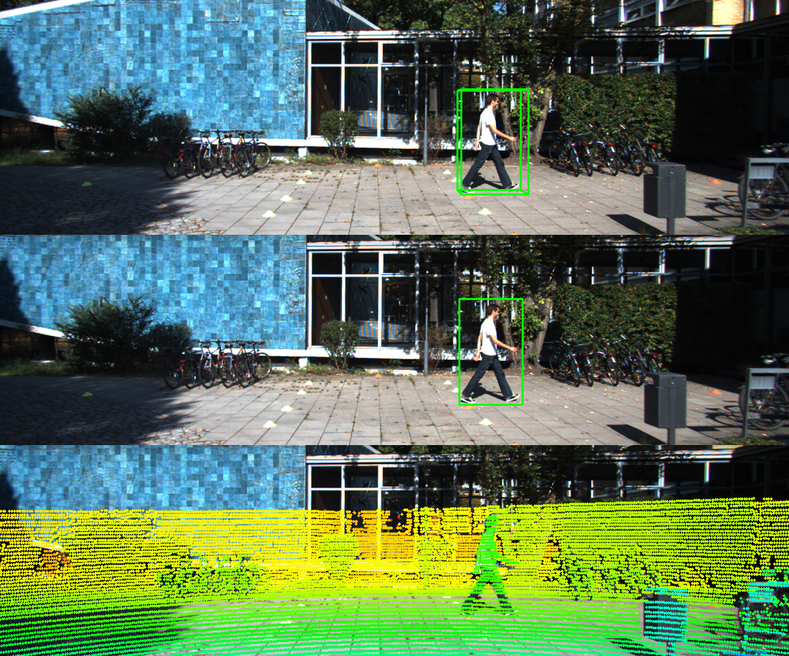
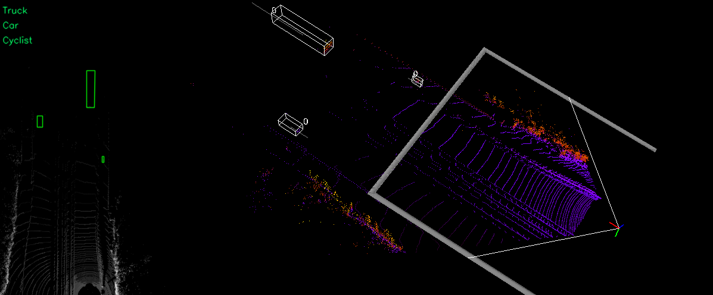
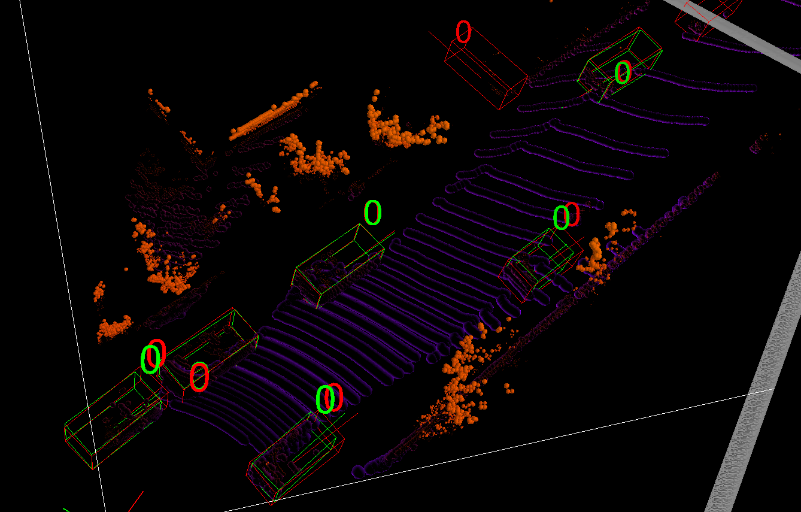

# KITTI Object data transformation and visualization


## Dataset

Download the data (calib, image\_2, label\_2, velodyne) from [Kitti Object Detection Dataset](http://www.cvlibs.net/datasets/kitti/eval_object.php?obj_benchmark=3d) and place it in your data folder at `kitti/object`


The folder structure is as following:
```
kitti
    object
        testing
            calib
            image_2
            label_2
            velodyne
        training
            calib
            image_2
            label_2
            velodyne
```

## Requirements

1. mayavi
2. vtk

```
pip install mayavi vtk
```

## Visualization

1. 3D boxes on LiDar point cloud in volumetric mode
2. 2D and 3D boxes on Camera image
3. 2D boxes on LiDar Birdview
4. LiDar data on Camera image


```python
$ python kitti_object.py --help
usage: kitti_object.py [-h] [-d N] [-i N] [-p] [-s] [-l N] [-e N] [-r N]
                       [--gen_depth] [--vis] [--depth] [--img_fov]
                       [--const_box] [--save_depth] [--pc_label]
                       [--show_lidar_on_image] [--show_lidar_with_depth]
                       [--show_image_with_boxes]
                       [--show_lidar_topview_with_boxes]

PyTorch Training RPN

optional arguments:
  -h, --help            show this help message and exit
  -d N, --dir N         input (default: data/object)
  -i N, --ind N         input (default: data/object)
  -p, --pred            show predict results
  -s, --stat            stat the w/h/l of point cloud in gt bbox
  -l N, --lidar N       velodyne dir (default: velodyne)
  -e N, --depthdir N    depth dir (default: depth)
  -r N, --preddir N     predicted boxes (default: pred)
  --gen_depth           generate depth
  --vis                 show images
  --depth               load depth
  --img_fov             front view mapping
  --const_box           constraint box
  --save_depth          save depth into file
  --pc_label            5-verctor lidar, pc with label
  --show_lidar_on_image
                        project lidar on image
  --show_lidar_with_depth
                        --show_lidar, depth is supported
  --show_image_with_boxes
                        show lidar
  --show_lidar_topview_with_boxes
                        show lidar topview
  --split               use training split or testing split (default: training)

```

```python
$ python kitti_object.py
```
Specific your own folder,
```python
$ python kitti_object.py -d /path/to/kitti/object
```

Show LiDAR only
```
$ python kitti_object.py --show_lidar_with_depth --img_fov --const_box --vis
```

Show LiDAR and image
```
$ python kitti_object.py --show_lidar_with_depth --img_fov --const_box --vis --show_image_with_boxes
```

Show LiDAR and image with specific index
```
$ python kitti_object.py --show_lidar_with_depth --img_fov --const_box --vis --show_image_with_boxes --ind 100 
```

Show LiDAR with label (5 vector)
```
$ python kitti_object.py --show_lidar_with_depth --img_fov --const_box --vis --pc_label
```

## Demo

#### 2D, 3D boxes and LiDar data on Camera image


#### LiDar birdview and point cloud (3D)


## Show Predicted Results

Firstly, map KITTI official formated results into data directory
```
./map_pred.sh /path/to/results
```

```python
python kitti_object.py -p
```



## Acknowlegement

Code is mainly from [f-pointnet](https://github.com/charlesq34/frustum-pointnets) and [MV3D](https://github.com/bostondiditeam/MV3D)
